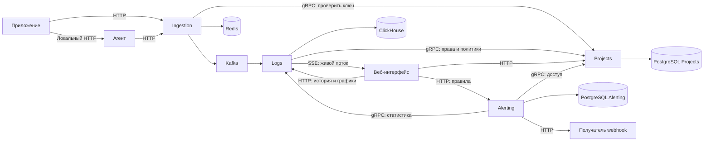

# LogFlux

LogFlux — сервис централизованного сбора и просмотра логов приложений.

Пользователь создаёт проект, получает API-ключ и подключает отправку логов через HTTP. В веб-интерфейсе доступны история, поиск, живой поток, графики и алерты.

## Стек

- **Go** — микросервисы и агент.
- **HTTP JSON** — внешнее API.
- **gRPC / Protobuf** — внутренние запросы между сервисами.
- **Kafka** — асинхронная доставка логов.
- **PostgreSQL** — пользователи, проекты, правила и уведомления.
- **ClickHouse** — хранение логов и аналитика.
- **Redis** — ограничения частоты запросов.
- **React + TypeScript** — веб-интерфейс.
- **Docker Compose** — локальный запуск.

## Архитектура

| Сервис | Ответственность |
|---|---|
| **Projects** | Пользователи, команды, проекты, роли и API-ключи. Проверка доступа через gRPC |
| **Ingestion** | Приём HTTP-запросов, валидация, проверка ключей, лимиты и публикация в Kafka |
| **Logs** | Чтение Kafka, обработка, запись в ClickHouse, поиск, статистика и live tail |
| **Alerting** | Проверка правил, состояния алертов, webhook и повторные попытки |

Каждый сервис владеет своими данными. Другие сервисы не обращаются напрямую к его таблицам. Обработка, хранение и поиск — модули Logs; отправка уведомлений — модуль Alerting.



## Приём логов

Endpoint: `POST /api/v1/logs`. Аутентификация: `Authorization: Bearer lfk_<id>.<secret>`.

```json
{
  "logs": [
    {
      "eventId": "550e8400-e29b-41d4-a716-446655440000",
      "timestamp": "2026-09-29T12:00:00Z",
      "service": "orders",
      "environment": "production",
      "level": "ERROR",
      "message": "Payment timeout",
      "attributes": {
        "orderId": "123"
      }
    }
  ]
}
```

Обязательные поля: `eventId`, `timestamp`, `service`, `level`, `message`. Дополнительно поддерживаются `traceId`, `spanId` и информация об исключении. Проект определяется по API-ключу.

- До 500 событий и 1 MiB распакованного тела на запрос.
- Невалидный пакет отклоняется с описанием ошибок.
- `202 Accepted` возвращается после подтверждения публикации всех записей пакета в Kafka. Это не означает готовность поиска.
- При неопределённом результате клиент повторяет запрос с прежними идентификаторами, временем и содержимым событий. Часть пакета уже могла быть опубликована.
- Logs нормализует записи, маскирует секреты и группирует похожие ошибки.
- Kafka offset подтверждается после устойчивого сохранения результата обработки.
- Повторная доставка не должна удваивать события в поиске, статистике и алертах. Идентичность события — `(projectId, eventId)`.
- Необрабатываемые сообщения попадают в DLQ с возможностью повторного запуска. Временный отказ БД вызывает повторную попытку, а не массовый перенос в DLQ.
- Базовое хранение логов — 7 дней.

## Просмотр логов

Веб-интерфейс предоставляет:

- историю с cursor pagination;
- фильтры по времени, сервису, окружению, уровню и `traceId`;
- поиск по тексту и просмотр полного события;
- график количества событий и ошибок;
- живой поток через SSE.

Задержанные события дополняют историю и прошлые интервалы графика. Live tail показывает свежие события; интерфейс отдельно отмечает догрузку. После переподключения обновляется последнее окно истории с удалением повторов.

## Агент

Необязательная клиентская программа на Go:

- принимает логи по локальному HTTP;
- устойчиво сохраняет их в дисковую очередь перед подтверждением;
- отправляет пакетами и повторяет временно неуспешные запросы;
- восстанавливает очередь после перезапуска;
- при заполнении удаляет самые старые неотправленные записи и учитывает потери;
- настраивается через YAML, секретный ключ получает из окружения.

Надёжность доставки ограничена ёмкостью очереди. Приложение обрабатывает недоступность самого агента. Прямая отправка в Ingestion без агента также поддерживается.

## Алерты

Пользователь создаёт правило, например: «более 10 ошибок за 5 минут».

Alerting получает статистику через gRPC, фиксирует срабатывание и отправляет подписанный webhook. Задание уведомления сохраняется вместе с изменением состояния алерта в транзакции PostgreSQL.

Внутренний worker доставляет уведомления с повторными попытками и историей доставки. При недоступности статистики алерт не считается автоматически разрешённым. Повтор webhook возможен и использует прежний идентификатор уведомления.

## Доступ и надёжность

- Пользователи входят в команды и имеют роли `OWNER`, `MEMBER`, `VIEWER`.
- API-ключи ограничены проектом и разрешениями, поддерживают отзыв.
- Данные разных проектов изолированы.
- Базовое маскирование секретов выполняется до публикации в Kafka.
- Запросы и фоновые задачи имеют таймауты и ограничения ресурсов.
- Доставка — **at-least-once**; логическая дедупликация реализуется отдельно. Фоновые merges ClickHouse не заменяют дедупликацию при чтении.
- Webhook защищён от запросов к внутренним и служебным адресам (SSRF).
- Сервисы предоставляют health checks, метрики и структурированные логи.

## Порядок реализации

1. HTTP-приём одного события в Ingestion.
2. Передача через Kafka в Logs.
3. Сохранение в ClickHouse и API истории.
4. Projects, API-ключи и gRPC-проверка доступа.
5. Фильтры, графики, веб-интерфейс и live tail.
6. Агент с дисковой очередью.
7. Алерты и webhook.
8. Проверки сбоев, метрики и нагрузочные тесты.

## Критерии готовности

Проект запускается через Docker Compose. Пользователь может подключить приложение, увидеть логи, найти ошибку и получить уведомление.

Тестами проверены изоляция проектов, повторная доставка, восстановление после сбоев, переполнение очереди агента и корректность статистики.

Целевая нагрузка: **100 событий/с постоянно и всплески до 1 000 событий/с в течение 60 секунд**. Эти показатели подтверждаются тестами; фактические результаты и условия измерений публикуются в репозитории.

## Сборка модулей

В каждом сервисе свой `go.mod`. Пути модулей соответствуют импортам:
`LogFlux/services/ingestion`, `LogFlux/services/logs`, `LogFlux/contracts`.
Корневой `go.work` объединяет модули для локальной работы. Корневой `go.mod`
пока сохранён как служебный модуль и источник версии Go для CI.

Из корня репозитория:

```bash
make tidy   # Обновить зависимости каждого модуля после изменения импортов
make check  # go vet, тесты с race detector, сборка
make build  # bin/ingestion и bin/logs

# Сборка одного сервиса без workspace:
(cd services/ingestion && GOWORK=off go build -o ../../bin/ingestion ./cmd/server)

# Запуск из корня; переменные из YAML должны быть заданы в окружении:
./bin/ingestion -config services/ingestion/config/local.yaml

# Docker: контекст — корень, не каталог сервиса:
docker build -f services/ingestion/Dockerfile -t logflux-ingestion .
```
